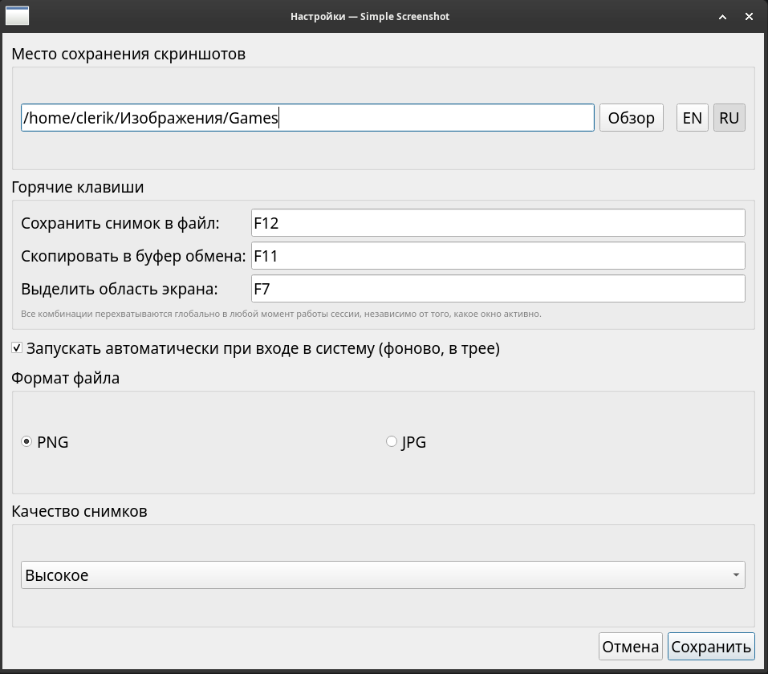

# Simple Screenshot

A simple screen-capture app with a tray icon (in the spirit of
Flameshot, but simpler): one-click screenshot, interactive region
selection, choice of save folder, three independent hotkeys (save to
file, copy to clipboard, select region), one-click autostart, PNG/JPG
formats, three quality levels.

The code is cross-platform and lives in `src/`. Each OS has its own
packaging folder under `packaging/`.

```
src/                      — shared cross-platform code (Linux + Windows)
  main.py, config.py, capture.py, tray_app.py, settings_dialog.py, ipc.py
  i18n.py                 — EN/RU interface translations, language switching
  hotkey/                 — global hotkey: x11.py (Linux/X11),
                            windows.py (WinAPI), common __init__.py factory
  autostart/               — autostart: linux.py (XDG autostart),
                            windows.py (registry), common __init__.py factory
  assets/                  — icons (svg for Linux, ico for Windows)

packaging/
  linux/                  — .deb metadata (control, .desktop, postinst…)
    build-deb.sh           <- builds the .deb with one command (needs dpkg-deb)
  windows/                — Windows build
    simple-screenshot.spec <- PyInstaller
    installer.iss            Inno Setup
    build.bat                full build with one command on Windows
    requirements-windows.txt
    README-WINDOWS.md        detailed instructions

.github/workflows/build-windows.yml
                          — cloud CI build of the installer (GitHub Actions)
```

## Linux (Debian/Ubuntu)

```bash
cd packaging/linux
./build-deb.sh
sudo apt install ../../build/simple-screenshot_1.3.2_all.deb
```

Dependencies (`python3-pyqt5`, `python3-xlib`) are pulled automatically
from the official repositories.

## Windows 10/11

The installers (`.exe` via NSIS and `.msi` via WiX/msitools) are built
**entirely on Linux**, with no Windows machine required: PyInstaller
runs under Wine on top of a real portable Windows Python build, and the
installers themselves are produced by native Linux utilities
(`makensis`, `wixl`). Details, verification steps and alternative
approaches (GitHub Actions, building on real Windows via Inno Setup)
are in `packaging/windows/README-WINDOWS.md`.

One-command build (on Debian/Ubuntu):

```bash
sudo dpkg --add-architecture i386
sudo apt update
sudo apt install -y wine wine32:i386 wine64 nsis msitools wixl wixl-data zstd curl
cd packaging/windows
./build-linux.sh
```

The result lands in `packaging/windows/dist/`: `SimpleScreenshot.exe`,
`SimpleScreenshot-Setup-1.3.2.exe`, `SimpleScreenshot-1.3.2.msi`.

## Environment support

- **X11** (any DE: XFCE, GNOME on Xorg, KDE Plasma on Xorg, Budgie,
  MATE, Cinnamon…) — full support, including both global hotkeys
  (save to file and copy to clipboard).
- **Wayland** — capture via `grim` (if installed); hotkeys are assigned
  through the desktop environment's own settings, bound to the
  commands `simple-screenshot --capture` (save to file) and
  `simple-screenshot --copy` (copy to clipboard) — this is a
  restriction of the Wayland protocol on global key interception, not
  an app limitation. The clipboard still works as usual (it's a
  separate Qt mechanism from screen capture).
- **Windows 10/11** — full support via Qt screen capture and the Qt
  clipboard, `RegisterHotKey` (WinAPI, independent for both keys) and
  autostart via the registry.

## Interface language: English / Russian

The interface is available in English (default) and Russian. Switch
languages from "Settings…" — the EN/RU toggle sits right next to the
"Browse" button. Switching applies instantly, without pressing "Save",
and updates the tray menu and notifications as well. The choice is
remembered in the config for next launch. Implementation is in
`src/i18n.py`.

## New: copy to clipboard

Besides saving to a file, you can now copy a screenshot straight to
the clipboard — via a separate, independently configurable hotkey
(`Ctrl+Print` by default, changeable in "Settings…" → "Hotkeys"). Also
available from the tray menu as "Copy screenshot to clipboard". The
settings dialog checks that the two combinations don't collide.

## New: screen region selection

A third independent hotkey (`Shift+Print` by default) opens an
interactive rectangular region selection with the mouse (a
semi-transparent overlay on top of the capture, like in Flameshot).
After selecting, a small action panel appears — "Save" / "Copy" /
cancel (✕ or Esc). Works on X11 and Windows through a custom Qt
overlay; on Wayland — via `slurp` + `grim` (there it saves straight to
a file, since slurp already provides its own selection UI).
Implementation is in `src/region_overlay.py` and
`capture.capture_region()`.

<p align="center">
  
</p>

<p align="center">
  
</p>

<p align="center">
  
</p>

Donate $5 to buy food for a cat:
<br>
USDT(TRC20): TWEmMHfc5DbQuDru8oaXNoXxTNkqYJbsYv<br>
BTC(BEP20): 0x147d19ae0e1b50ca6c87d32b2f716068e6ba5b17<br>
SOL(SOL): j3kkX7VuKfchcnH8Y9bUCbqjjA4ssLpspvsw4YZi8ia<br>
