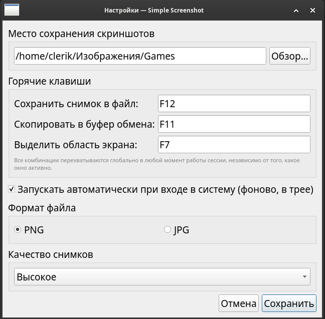

# Simple Screenshot

Простое приложение для захвата экрана со значком в трее (аналог по духу
Flameshot, но проще): скриншот одним нажатием, выделение произвольной
области экрана, выбор папки сохранения, три независимые горячие
клавиши (сохранение в файл, копирование в буфер обмена, выделение
области), автозапуск в один клик, форматы PNG/JPG, три уровня качества.

Код кроссплатформенный и живёт в `src/`. Под каждую ОС — своя папка
упаковки в `packaging/`.

```
src/                      — общий кроссплатформенный код (Linux + Windows)
  main.py, config.py, capture.py, tray_app.py, settings_dialog.py, ipc.py
  hotkey/                 — глобальная горячая клавиша: x11.py (Linux/X11),
                            windows.py (WinAPI), общий __init__.py-фабрика
  autostart/              — автозапуск: linux.py (XDG autostart),
                            windows.py (реестр), общий __init__.py-фабрика
  assets/                 — иконки (svg для Linux, ico для Windows)

packaging/
  linux/                  — метаданные .deb (control, .desktop, postinst…)
    build-deb.sh           <- собирает .deb одной командой (нужен dpkg-deb)
  windows/                — сборка под Windows
    simple-screenshot.spec <- PyInstaller
    installer.iss           <- Inno Setup
    build.bat               <- полная сборка одной командой на Windows
    requirements-windows.txt
    README-WINDOWS.md       <- подробная инструкция

.github/workflows/build-windows.yml
                          — CI-сборка установщика в облаке (GitHub Actions)
```

## Linux (Debian/Ubuntu)

```bash
cd packaging/linux
./build-deb.sh
sudo apt install ../../build/simple-screenshot_1.3.1_all.deb
```

Зависимости (`python3-pyqt5`, `python3-xlib`) подтянутся из официальных
репозиториев автоматически.

## Windows 10/11

Установщики (`.exe` через NSIS и `.msi` через WiX/msitools) собираются
**целиком на Linux**, без единой Windows-машины: PyInstaller запускается
под Wine поверх настоящего portable Windows Python, а сами установщики —
уже нативными Linux-утилитами (`makensis`, `wixl`). Подробности,
проверка и альтернативные способы (GitHub Actions, сборка на реальной
Windows через Inno Setup) — в `packaging/windows/README-WINDOWS.md`.

Сборка одной командой (на Debian/Ubuntu):

```bash
sudo dpkg --add-architecture i386
sudo apt update
sudo apt install -y wine wine32:i386 wine64 nsis msitools wixl wixl-data zstd curl
cd packaging/windows
./build-linux.sh
```

Результат — в `packaging/windows/dist/`: `SimpleScreenshot.exe`,
`SimpleScreenshot-Setup-1.3.1.exe`, `SimpleScreenshot-1.3.1.msi`.

## Поддержка окружений

- **X11** (любое DE: XFCE, GNOME on Xorg, KDE Plasma on Xorg, Budgie,
  MATE, Cinnamon…) — полная поддержка, включая обе глобальные горячие
  клавиши (сохранение в файл и копирование в буфер обмена).
- **Wayland** — захват через `grim` (если установлен); горячие клавиши
  назначаются средствами самого окружения на команды
  `simple-screenshot --capture` (сохранить в файл) и
  `simple-screenshot --copy` (скопировать в буфер обмена) — ограничение
  протокола Wayland на глобальный перехват клавиш, не зависит от
  приложения. Буфер обмена при этом работает как обычно (это отдельный
  от захвата экрана механизм Qt).
- **Windows 10/11** — полная поддержка через Qt-захват экрана и Qt же
  буфер обмена, `RegisterHotKey` (WinAPI, независимо для обеих клавиш)
  и автозапуск через реестр.

## Новое: копирование в буфер обмена

Помимо сохранения в файл, теперь можно скопировать снимок сразу в
буфер обмена — по отдельной, независимо настраиваемой горячей клавише
(по умолчанию `Ctrl+Print`, меняется в «Настройки…» → «Горячие
клавиши»). Также доступно из меню трея пунктом «Скопировать снимок в
буфер обмена». Проверка на совпадение обеих комбинаций встроена в
диалог настроек.

## Новое: выделение области экрана

Третья независимая горячая клавиша (по умолчанию `Shift+Print`)
открывает интерактивное выделение прямоугольной области экрана мышью
(полупрозрачный оверлей поверх снимка, как в Flameshot). После
выделения появляется маленькая панель с выбором действия —
«Сохранить» / «Копировать» / отмена (✕ или Esc). Работает на X11 и
Windows через собственный оверлей на Qt; на Wayland — через связку
`slurp` + `grim` (там сразу сохраняет в файл, т.к. slurp уже
предоставляет свой интерфейс выделения). Реализация — в
`src/region_overlay.py` и `capture.capture_region()`.

<p align="center">
  
</p>

<p align="center">
  
</p>
